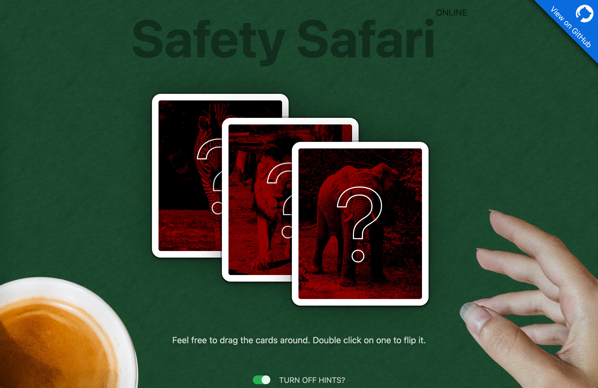

# Safety Safari (Online)

A simple card game interface to spice up online workshops where the faciliator walks their attendees through three digital safety scenarios. Feel free to customize it and use it in your own workshops!

[View a live demo online.](https://safetysafari.narwhalacademy.org)

## How to use

Note: Safety Safari assumes that the faciliator is sharing their screen on a desktop or laptop computer (it doesn't really work on phones or tablets very well).

- Download files into a local folder.
- Open `index.html` with a text or HTML editor of choice.
- Modify the three questions (they are marked in all caps) to ones that you want to use with your attendees.
- Save and close file.
- Open `index.html` in a web browser (in most cases, double clicking `index.html` will do the job).
- Double click on any card to reveal the question.
- Feel free to drag the cards around for dramatic effect.

## Image credits & licesning info

- Background texture remixed from [ambientCG](https://ambientcg.com/view?id=Fabric034), under the Creative Commons CC0 1.0 Universal License.
- Elephant photo remixed from [Skica911 on Pixabay](https://pixabay.com/photos/elephant-african-elephant-africa-7774904/), under the Pixabay Content License.
- Lion photo remixed from [garten-gg on Pixabay](https://pixabay.com/photos/wildlife-lion-predator-big-cat-4878353/), under the Pixabay Content License.
- Zebra photo remixed from [christels on Pixabay](https://pixabay.com/photos/zebra-walk-equine-stripe-animal-3703855/), under the Pixabay Content License.
- Hand photo from [Vika_Glitter on Pixabay](https://pixabay.com/photos/hand-fingers-palm-model-brush-6606082/), under the Pixabay Content License.
- Coffee cup photo from [yousafbhutta on Pixabay](https://pixabay.com/photos/coffee-cup-drink-beverage-7292250/)